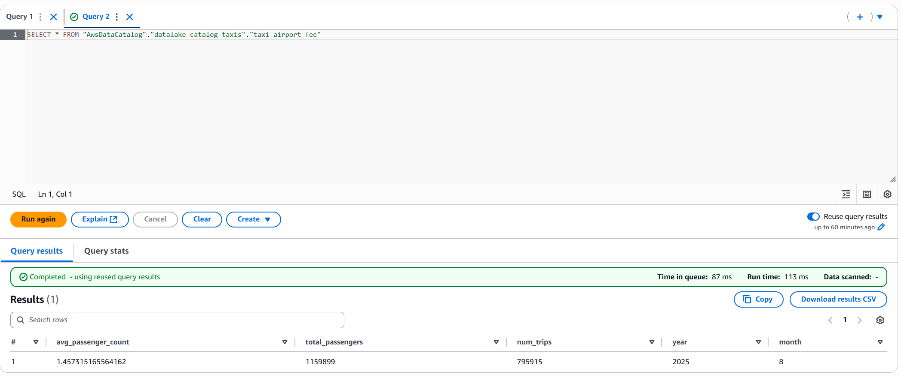

# AwsDataLake

# Taxi Data Pipeline

Este proyecto se crea un **DataLake** donde implementa un flujo de procesamiento de datos de taxis de Nueva York, desde la ingestión hasta la preparación para análisis y consultas, utilizando **AWS Glue, S3, Lambda y Step Functions**.

## 1. Análisis Exploratorio de Datos (EDA)

Se realizó un **análisis inicial de los datos en Parquet** para identificar la calidad, distribución y características de las variables. Esto permitió definir las reglas de limpieza, validación y transformación necesarias para el pipeline.

## 1. Análisis Exploratorio de Datos (EDA_TAXIS.ipynb)

Se realizó un **análisis inicial de los datos en Parquet** para identificar calidad, distribución y características de las variables. Esto permitió definir reglas de limpieza y transformación.

## 2. Organización del almacenamiento en S3

- **RAW:** datos originales sin transformar, separados por años
- **CLEAN:** datos depurados, particionados por año y mes.
- **CURATED:** datos listos para análisis, organizados por consultas específicas y particionados por año y mes.

## 3. Catálogo y Crawlers

- Base de datos en Glue con crawlers para cada zona de datos: RAW, CLEAN y CURATED.
- Tablas de metadatos disponibles para consultas en Athena y lectura en Jobs.

## 4. Transformaciones con AWS Glue

- Base de datos en Glue con crawlers para cada zona de datos: RAW, CLEAN y CURATED.
- Tablas de metadatos disponibles para consultas en Athena.

Se crearon **dos tipos de jobs para cada etapa**:

- **RAW → CLEAN:**

  - Job masivo que transforma todos los archivos RAW.
  - Job incremental que procesa solo los archivos de un mes y año específicos.
  - Incluye validaciones de datos, limpieza de inconsistencias y cálculo de nuevas columnas como duración del viaje.
  - Redondeo de montos, corrección de valores nulos, filtrado de valores fuera de rango, y asignación de categorías válidas.

- **CLEAN → CURATED:**
  - Job masivo que transforma todos los datos CLEAN.
  - Job incremental que procesa solo los datos del mes y año correspondientes.
  - Genera consultas específicas: Airport Fee, Total Amount por día y Eficiencia (total_amount / trip_distance).
  - Agrupa, resume y guarda los resultados en carpetas particionadas por año y mes, listas para análisis o consultas con Athena.

## 5. Automatización del flujo

- **Lambda** detecta la llegada de nuevos archivos en RAW y activa la **Step Function**, en eesta lamda se extrae el file path del archivo nuevo y el año y mes al cual pertenece, estos son parametros que se le envían a la step function para solo activar los trabajos para este archivo en especifico.

- La **Step Function** ejecuta los jobs de Glue en orden: primero RAW → CLEAN, luego CLEAN → CURATED, entre estas se hace un retry por si hay fallas en algún trabajo, luego de los jobs se corre el Crawler de curated para actualizar las tablas

### Solamente se procesa la información de este nuevo archivo para cada una de las zonas

## 6. Athena

- Se tienen 3 consultas para ver las carpetas creadas en curated

  - Airport fee: se quizo crear para saber la cantidad de pasajeros que tienen los taxis que hacen viajes en aeropuertos y así poder ver como asignar la flota de mejor manera
  - Total Amount: comparación de income por diferentes periodos de tiempo
  - Eficiencia: comparar según el códgigo de area como es la eficiencia del viaje

  

# VIDEO DEMO

- Upload file: muestra como se activa la SF cuando se sube un archivo
- Curated Files: muestra las carpetas que se crearon en el job clean-curated apartir del nuevo archivo
